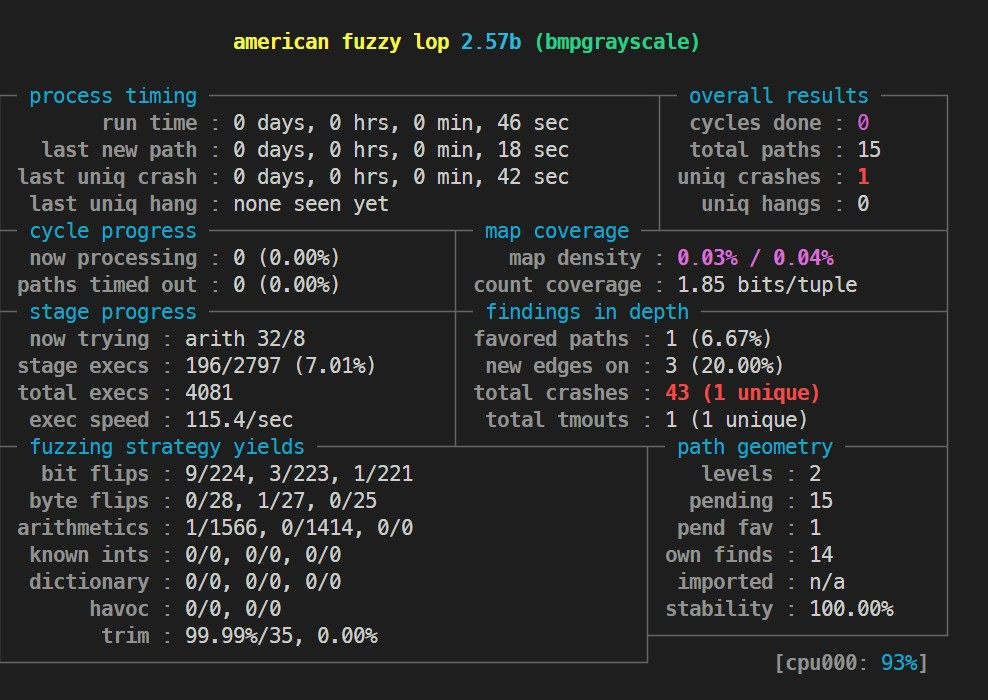
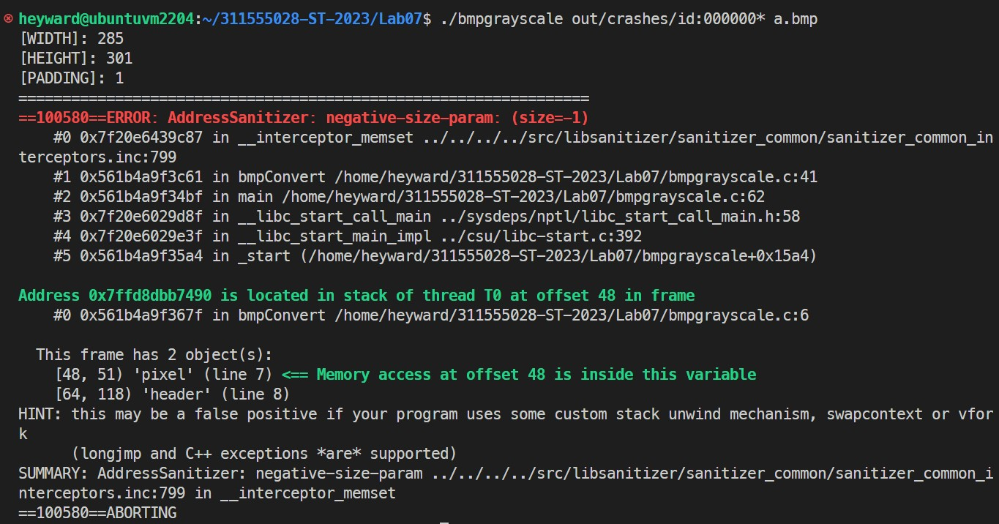

# ST-311555028-Lab07
## Fuzz testing with AFL
### 1. Build AFL
```sh
git clone https://github.com/google/AFL.git
cd AFL
make
sudo make install
```

### 2. Build target and fuzz with AFL
```sh
cd Lab07
export CC=~/AFL/afl-gcc
export AFL_USE_ASAN=1
make 
mkdir in
cp test.bmp in/
~/AFL/afl-fuzz -i in -o out -m none -- ./bmpgrayscale @@ a.bmp
```



### 3. Trigger the crash with input which founded by AFL
```sh
./bmpgrayscale out/crashes/id:000000* a.bmp
```
